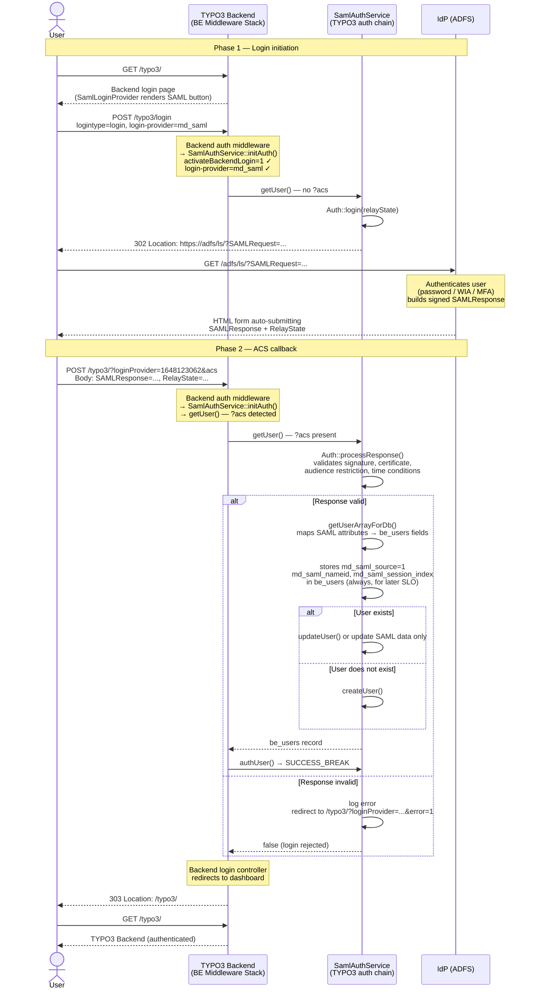

# Backend SAML Login (SP-initiated) — Flow

The diagram shows the SP-initiated SSO login flow for a backend user authenticating
via SAML. The flow is structurally identical to the frontend login, but differs in
the activation mechanism, the user table, and the post-login redirect behaviour.

## Phase 1 — Login initiation

### Step 1 — The SAML login button

When a user visits `/typo3/`, TYPO3's backend login controller looks up all registered
login providers and renders the active one. `SamlLoginProvider` is registered with the
provider ID `1648123062` and renders a Fluid template
(`Resources/Private/Templates/Backend/LoginSaml.html`) containing a button (or form)
that submits `login-provider=md_saml` and `logintype=login` to the backend login
controller. If a prior login attempt failed, `?error=1` is passed back and the template
shows an error notice.

### Step 2 — Auth service activation

The backend authentication middleware calls `SamlAuthService::initAuth()`. For BE
context, the service checks the `activateBackendLogin` flag in the TYPO3 Extension
Configuration (not in the site-set configuration, which governs frontend settings).
Only if that flag is `1` does the service call `inCharge()` to confirm that
`login-provider=md_saml` is present in the request and that `logintype=login` is set.

### Step 3 — Redirecting to the IdP

`SamlAuthService::getUser()` is called. Since no `?acs` parameter is present, it
calls `Auth::login()` which builds a signed `AuthnRequest`, encodes it in the redirect
URL, and issues a `Location` header to the IdP's SSO endpoint. A `RelayState` carrying
the intended return URL is included if `redirect_url` or `referer` is present in the
POST body. The PHP process exits cleanly at this point.

---

## Phase 2 — ACS callback

### Step 4 — IdP authenticates the user

The browser follows the redirect to the IdP (e.g. ADFS). After successful
authentication (password, Windows Integrated Authentication, MFA, etc.), the IdP
builds a signed `SAMLResponse` and POST-binds it to the configured
`sp.assertionConsumerService.url` — typically `/typo3/?loginProvider=1648123062&acs`.

### Step 5 — Validating the SAMLResponse

The browser POSTs the SAMLResponse to the ACS URL. The backend authentication
middleware calls `SamlAuthService::getUser()` again. The presence of `?acs` triggers
`Auth::processResponse()`, which validates the signature, certificate, audience
restriction, and time conditions of the assertion.

### Step 6 — Creating or updating the be_users record

SAML attributes from the assertion are mapped to `be_users` fields via the
`transformationArr` site-set configuration. The record is then either created
(if `createIfNotExist=true`) or updated (if `updateIfExist=true`). Regardless
of the `updateIfExist` setting, three SAML session fields are always written to
`be_users` so that SP-initiated SLO can read them at logout time:

| Column | Content |
|---|---|
| `md_saml_source` | `1` — marks this record as SAML-authenticated |
| `md_saml_nameid` | NameID from the assertion (used in the LogoutRequest) |
| `md_saml_nameid_format` | NameID format URI |
| `md_saml_session_index` | IdP session index (used in the LogoutRequest) |

TYPO3 does not use PHP sessions, so the library's built-in `$_SESSION` storage for
this data is unavailable between requests. Persisting it in `be_users` is the only
reliable way to make it available when the user later triggers an SP-initiated logout.

### Step 7 — Backend loads

`SamlAuthService::authUser()` returns `SUCCESS_BREAK`. TYPO3's backend login
controller detects the successful authentication and redirects the user to the
backend dashboard (or to the URL from `RelayState` if one was preserved by the IdP).
There is no middleware equivalent to `SlsFrontendSamlMiddleware` for the backend —
the standard TYPO3 backend login controller handles the final redirect.

## Sequence diagram

