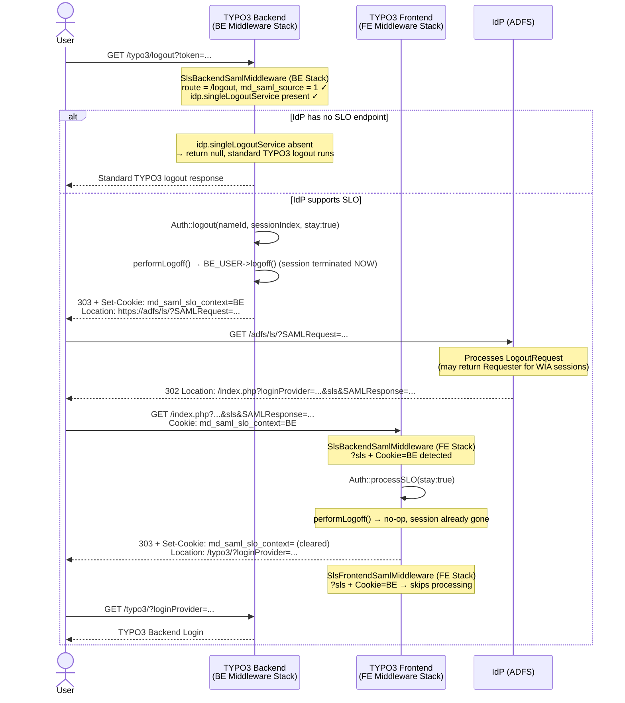

# Backend Single Logout (SP-initiated) — Flow

The diagram shows the SP-initiated SLO flow for a backend user who logged in via SAML.

## IdPs without SLO support

Some IdPs (e.g. Google Workspace) do not provide a Single Logout Service endpoint. When `saml.idp.singleLogoutService.url` is empty in the site configuration, `SettingsService` strips the SLO endpoint keys from the settings before passing them to the SAML library. `SlsBackendSamlMiddleware` detects the missing key and returns `null` immediately, so the standard TYPO3 logout handler runs as it did before v5.0.0 — no SAML protocol round-trip is attempted.

## Step 1 — Intercepting the logout

When the user clicks logout in the TYPO3 backend, `SlsBackendSamlMiddleware` intercepts the `/typo3/logout` route before the standard route dispatcher runs. It checks that the user was originally authenticated via SAML (`md_saml_source = 1`), that backend SAML login is enabled, and that the IdP has an SLO endpoint configured. It then builds a signed SAML `LogoutRequest` containing the user's `NameID` and `SessionIndex` — both stored in the `be_users` record at login time, since TYPO3 does not use PHP sessions.

## Step 2 — Terminating the local session and marking the context

Before redirecting to the IdP, the middleware:

1. **Terminates the local TYPO3 backend session immediately** (`BE_USER->logoff()`). This ensures the user is always logged out of TYPO3 even if the IdP SLO callback never arrives — for example due to a network failure, IdP timeout, or an IdP that nominally supports SLO but does not reliably send the callback.
2. Sets a short-lived `HttpOnly` cookie (`md_saml_slo_context=BE`). This is necessary because ADFS does not preserve a custom `RelayState` from the `LogoutRequest`, so there would otherwise be no way to identify the returning callback as a backend SLO.

## Step 3 — IdP processes the logout

The browser follows the redirect to the IdP, which processes the `LogoutRequest` and sends a `LogoutResponse` back to the configured `sp.singleLogoutService.url`. In this setup, that URL points to the TYPO3 frontend — which is why the middleware is registered in both the backend and the frontend stack.

## Step 4 — Processing the callback

The IdP callback arrives at the frontend stack. `SlsBackendSamlMiddleware` (registered in the FE stack) detects the cookie and takes over. `SlsFrontendSamlMiddleware` sees the same cookie and skips processing entirely. The BE middleware calls `processSLO()` with `stay: true` to prevent the library from issuing an `exit()`. Since the session was already terminated in Step 2, `performLogoff()` is a safe no-op. If the IdP returns a non-success status (e.g. ADFS with Windows Integrated Authentication cannot terminate WIA sessions via SAML), the behaviour is unchanged — the user is already logged out of TYPO3.

## Step 5 — Redirect to backend login

After the callback is processed, the cookie is cleared and the user is redirected to the TYPO3 backend login page.

## Sequence diagram

