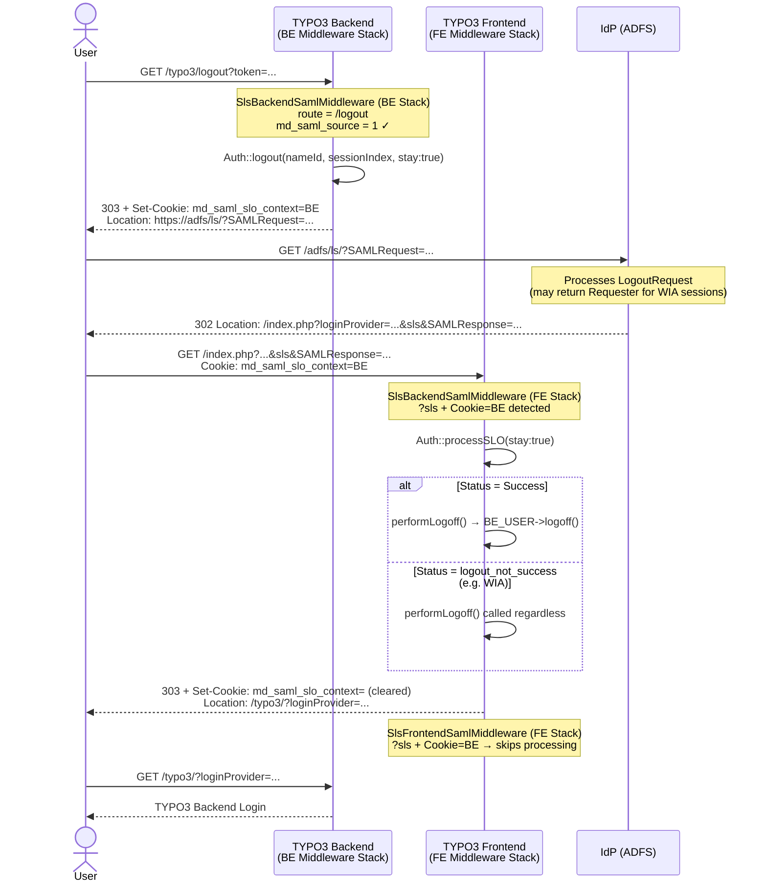

# Backend Single Logout (SP-initiated) — Flow

The diagram shows the SP-initiated SLO flow for a backend user who logged in via SAML.

## Step 1 — Intercepting the logout
When the user clicks logout in the TYPO3 backend, `SlsBackendSamlMiddleware` intercepts the `/typo3/logout` route before the standard route dispatcher runs. It checks that the user was originally authenticated via SAML (`md_saml_source = 1`) and builds a signed SAML `LogoutRequest` containing the user's `NameID` and `SessionIndex` — both stored in the `be_users` record at login time, since TYPO3 does not use PHP sessions.

## Step 2 — Marking the context

Before redirecting to the IdP, the middleware sets a short-lived `HttpOnly` cookie (`md_saml_slo_context=BE`). This is necessary because ADFS does not preserve a custom `RelayState` from the `LogoutRequest`, so there would otherwise be no way to identify the returning callback as a backend SLO.

## Step 3 — IdP processes the logout

The browser follows the redirect to ADFS, which processes the `LogoutRequest` and sends a `LogoutResponse` back to the configured `sp.singleLogoutService.url`. In this setup, that URL points to the TYPO3 frontend — which is why the middleware is registered in both the backend and the frontend stack.

## Step 4 — Processing the callback

The IdP callback arrives at the frontend stack. `SlsBackendSamlMiddleware` (registered in the FE stack) detects the cookie and takes over. `SlsFrontendSamlMiddleware` sees the same cookie and skips processing entirely. The BE middleware calls `processSLO()` with `stay: true` to prevent the library from issuing an `exit()`. If the IdP returns a non-success status (e.g. ADFS with Windows Integrated Authentication cannot terminate WIA sessions via SAML), the local TYPO3 session is terminated regardless.

## Step 5 — Redirect to backend login

After the session is terminated, the cookie is cleared and the user is redirected to the TYPO3 backend login page.

## Sequence diagram

