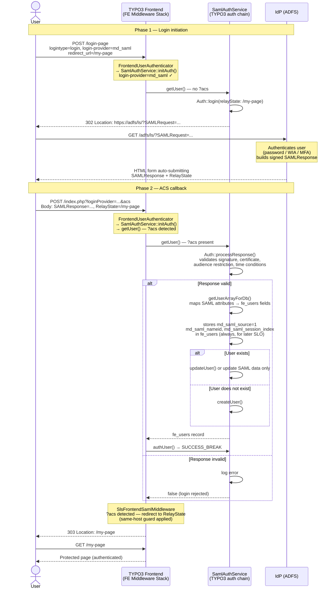

# Frontend SAML Login (SP-initiated) — Flow

The diagram shows the SP-initiated SSO login flow for a frontend user authenticating
via SAML. The flow has two phases: the initial login redirect to the IdP, and the
ACS callback when the IdP posts the authentication result back to TYPO3.

## Phase 1 — Login initiation

### Step 1 — User triggers SAML login

The user submits the felogin form with `login-provider=md_saml` and `logintype=login`.
This can happen on a protected page (automatic redirect) or by explicitly clicking a
"Login with SSO" button.

### Step 2 — Auth service takes over

`FrontendUserAuthenticator` calls the registered TYPO3 authentication service chain.
`SamlAuthService::initAuth()` detects SAML via the `login-provider=md_saml` parameter
and sets itself as active. `SamlAuthService::getUser()` is then called. Since no `?acs`
parameter is present, it knows this is the initial login request (not an IdP callback).

### Step 3 — Redirecting to the IdP

`Auth::login()` is called with a `RelayState` carrying the intended redirect target URL
(from `redirect_url` or `referer` in the POST body). The library builds a signed
`AuthnRequest`, encodes it as a query parameter, and issues a redirect to the IdP's
SSO endpoint. The PHP process exits cleanly at this point — the user's browser follows
the redirect to the IdP.

---

## Phase 2 — ACS callback

### Step 4 — IdP authenticates the user

The browser follows the redirect to the IdP (e.g. ADFS). After the user authenticates
(password, Windows Integrated Authentication, MFA, etc.), the IdP builds a signed
`SAMLResponse` and POST-binds it to the configured `sp.assertionConsumerService.url`
(`?acs` parameter).

### Step 5 — Validating the SAMLResponse

The browser POSTs the SAMLResponse to the ACS URL. `FrontendUserAuthenticator` runs
again. `SamlAuthService::getUser()` detects `?acs` and calls `Auth::processResponse()`,
which validates the signature, the certificate, the audience restriction, and the
time conditions of the assertion.

### Step 6 — Creating or updating the fe_users record

SAML attributes from the assertion are mapped to fe_users fields via the
`transformationArr` site-set configuration. The record is then either created
(if `createIfNotExist=true`) or updated (if `updateIfExist=true`). Regardless of
the `updateIfExist` setting, three SAML session fields are always written to
fe_users so that SP-initiated SLO can read them at logout time:

| Column | Content |
|---|---|
| `md_saml_source` | `1` — marks this record as SAML-authenticated |
| `md_saml_nameid` | NameID from the assertion (used in the LogoutRequest) |
| `md_saml_nameid_format` | NameID format URI |
| `md_saml_session_index` | IdP session index (used in the LogoutRequest) |

TYPO3 does not use PHP sessions, so the library's built-in `$_SESSION` storage for
this data is unavailable. Persisting it in the database record is the only reliable
way to make it available between the login and a later SP-initiated logout request.

### Step 7 — Redirect to the original page

`SamlAuthService::authUser()` confirms the login with `SUCCESS_BREAK`. Once the
authentication middleware has finished, `SlsFrontendSamlMiddleware` detects the `?acs`
parameter, lets the rest of the middleware stack run (so TYPO3 registers the user in
the request context), then redirects to the `RelayState` URL — the page the user
originally intended to visit. The redirect is only issued if the RelayState is a valid
URL on the same host and differs from the ACS URL itself (open-redirect guard).

## Sequence diagram

