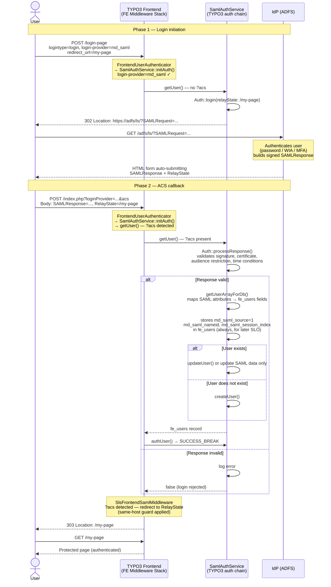

# Frontend SAML Login (SP-initiated) — Flow

The diagram shows the SP-initiated SSO login flow for a frontend user authenticating
via SAML. The flow has two phases: the initial login redirect to the IdP, and the
ACS callback when the IdP posts the authentication result back to TYPO3.

## Phase 1 — Login initiation

### Step 1 — User triggers SAML login

The user submits the felogin form with `login-provider=md_saml` and `logintype=login`.
This can happen on a protected page (automatic redirect) or by explicitly clicking a
"Login with SSO" button.

### Step 2 — Auth service takes over

`FrontendUserAuthenticator` calls the registered TYPO3 authentication service chain.
`SamlAuthService::initAuth()` detects SAML via the `login-provider=md_saml` parameter
and sets itself as active. `SamlAuthService::getUser()` is then called. Since no `?acs`
parameter is present, it knows this is the initial login request (not an IdP callback).

### Step 3 — Redirecting to the IdP

`Auth::login()` is called with a `RelayState` carrying the intended redirect target URL
(from `redirect_url` or `referer` in the POST body). The library builds a signed
`AuthnRequest`, encodes it as a query parameter, and issues a redirect to the IdP's
SSO endpoint. The PHP process exits cleanly at this point — the user's browser follows
the redirect to the IdP.

---

## Phase 2 — ACS callback

### Step 4 — IdP authenticates the user

The browser follows the redirect to the IdP (e.g. ADFS). After the user authenticates
(password, Windows Integrated Authentication, MFA, etc.), the IdP builds a signed
`SAMLResponse` and POST-binds it to the configured `sp.assertionConsumerService.url`
(`?acs` parameter).

### Step 5 — Validating the SAMLResponse

The browser POSTs the SAMLResponse to the ACS URL. `FrontendUserAuthenticator` runs
again. `SamlAuthService::getUser()` detects `?acs` and calls `Auth::processResponse()`,
which validates the signature, the certificate, the audience restriction, and the
time conditions of the assertion.

### Step 6 — Creating or updating the fe_users record

SAML attributes from the assertion are mapped to fe_users fields via the
`transformationArr` site-set configuration. An existing record is looked up by
`md_saml_identity` first (if that column is mapped from a SAML attribute and
present in the assertion), falling back to `username` otherwise — see
[Matching existing users](#matching-existing-users) below. The record is then
either created (if `createIfNotExist=true`) or updated (if `updateIfExist=true`).
Regardless of the `updateIfExist` setting, SAML session/tracking fields are
always written to fe_users so that SP-initiated SLO can read them at logout time
(and so identity-based matching becomes effective from the next login on):

| Column | Content |
| --- | --- |
| `md_saml_source` | `1` — marks this record as SAML-authenticated |
| `md_saml_nameid` | NameID from the assertion (used in the LogoutRequest) |
| `md_saml_nameid_format` | NameID format URI |
| `md_saml_session_index` | IdP session index (used in the LogoutRequest) |
| `md_saml_identity` | Stable identity attribute value, if `transformationArr` maps one |

TYPO3 does not use PHP sessions, so the library's built-in `$_SESSION` storage for
this data is unavailable. Persisting it in the database record is the only reliable
way to make it available between the login and a later SP-initiated logout request.

#### Matching existing users

By default, an existing user is matched by `username` alone. If `username` is
mapped to a mutable attribute (e.g. an email address), a user record can no
longer be found once that attribute changes at the IdP, and — with
`createIfNotExist=true` — a second, duplicate record is created instead.

To avoid this, map a SAML attribute that stays constant for the lifetime of the
IdP account to `md_saml_identity` in `transformationArr`. When present in the
assertion, the existing record is looked up by `md_saml_identity` *before*
`username`, so the same local record is kept even if `username` changes later
on. `md_saml_identity` is backfilled automatically from the first login after
it is mapped - no manual migration is needed.

**Security:** only map an attribute that is fully IdP-controlled, never
reassigned to a different person, and not editable by end users themselves.
Whoever presents this value in a future login is matched onto — and logged in
as — the existing local record that already holds it. This requirement already
applies to `username` today; mapping `md_saml_identity` extends it to a second
field, it does not relax it.

Which attribute to use depends on the IdP — see the commented example and its
trade-offs in `Configuration/Sets/MdSamlBase/settings.yaml`. In short: for
ADFS/on-prem AD, `objectGUID` is the most durable choice but needs a custom
claim rule (it's binary and has no ready-made claim type); the `primarysid`
claim (the user's AD `objectSID`) is easier to set up via the standard "Send
LDAP Attributes as Claims" rule and works in practice, but isn't perfectly
immutable — it changes on account deletion/recreation or on a domain/forest
migration without preserved `sIDHistory`. For Azure AD/Entra ID, the Entra
Object ID claim (`.../identity/claims/objectidentifier`) is the equivalent
stable choice.

If matching by `md_saml_identity` finds a record whose `username` differs from
the incoming one, and that new `username` is already used by a *different*
record, the rename is skipped (with a warning logged) while all other fields
still sync — TYPO3 has no unique constraint on `username`, so two records are
never silently merged under one login name.

### Step 7 — Redirect to the original page

`SamlAuthService::authUser()` confirms the login with `SUCCESS_BREAK`. Once the
authentication middleware has finished, `SlsFrontendSamlMiddleware` detects the `?acs`
parameter, lets the rest of the middleware stack run (so TYPO3 registers the user in
the request context), then redirects to the `RelayState` URL — the page the user
originally intended to visit. The redirect is only issued if the RelayState is a valid
URL on the same host and differs from the ACS URL itself (open-redirect guard).

## Sequence diagram

```mermaid
sequenceDiagram
    actor User
    participant FE as TYPO3 Frontend<br/>(FE Middleware Stack)
    participant Auth as SamlAuthService<br/>(TYPO3 auth chain)
    participant ADFS as IdP (ADFS)

    Note over User,ADFS: Phase 1 — Login initiation

    User->>FE: POST /login-page<br/>logintype=login, login-provider=md_saml<br/>redirect_url=/my-page

    note over FE: FrontendUserAuthenticator<br/>→ SamlAuthService::initAuth()<br/>login-provider=md_saml ✓

    FE->>Auth: getUser() — no ?acs
    Auth->>Auth: Auth::login(relayState: /my-page)
    Auth-->>User: 302 Location: https://adfs/ls/?SAMLRequest=...

    User->>ADFS: GET /adfs/ls/?SAMLRequest=...
    note over ADFS: Authenticates user<br/>(password / WIA / MFA)<br/>builds signed SAMLResponse
    ADFS-->>User: HTML form auto-submitting<br/>SAMLResponse + RelayState

    Note over User,ADFS: Phase 2 — ACS callback

    User->>FE: POST /index.php?loginProvider=...&acs<br/>Body: SAMLResponse=..., RelayState=/my-page

    note over FE: FrontendUserAuthenticator<br/>→ SamlAuthService::initAuth()<br/>→ getUser() — ?acs detected

    FE->>Auth: getUser() — ?acs present
    Auth->>Auth: Auth::processResponse()<br/>validates signature, certificate,<br/>audience restriction, time conditions

    alt Response valid
        Auth->>Auth: getUserArrayForDb()<br/>maps SAML attributes → fe_users fields
        Auth->>Auth: stores md_saml_source=1<br/>md_saml_nameid, md_saml_session_index<br/>in fe_users (always, for later SLO)
        alt User exists
            Auth->>Auth: updateUser() or update SAML data only
        else User does not exist
            Auth->>Auth: createUser()
        end
        Auth-->>FE: fe_users record
        FE->>Auth: authUser() → SUCCESS_BREAK
    else Response invalid
        Auth->>Auth: log error
        Auth-->>FE: false (login rejected)
    end

    note over FE: SlsFrontendSamlMiddleware<br/>?acs detected — redirect to RelayState<br/>(same-host guard applied)

    FE-->>User: 303 Location: /my-page

    User->>FE: GET /my-page
    FE-->>User: Protected page (authenticated)
```
