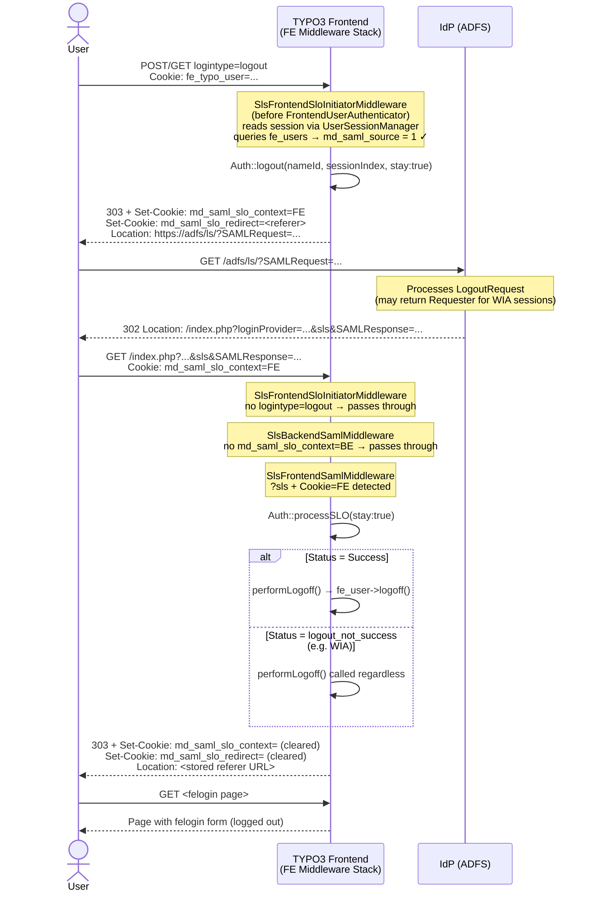

# Frontend Single Logout (SP-initiated) — Flow

The diagram shows the SP-initiated SLO flow for a frontend user who logged in via SAML.

## Step 1 — Intercepting the logout

When the user clicks logout in a felogin form, the browser sends a request with `logintype=logout` (either as a POST body parameter or a GET query parameter). `SlsFrontendSloInitiatorMiddleware` intercepts this request **before** `FrontendUserAuthenticator` runs. This ordering is critical: `FrontendUserAuthenticator` calls `FrontendUserAuthentication::start()`, which processes `logintype=logout` and calls `logoff()` — so the user would already be gone by the time a post-authentication middleware could act.

## Step 2 — Reading the session

Because the request attribute `frontend.user` is not yet populated at this stage, the middleware reads the session directly via `UserSessionManager::create('FE')`. It resolves the session from the FE session cookie, retrieves the user ID, and queries `fe_users` for `md_saml_source`, `md_saml_nameid`, `md_saml_nameid_format`, and `md_saml_session_index`. If the user is not a SAML user (`md_saml_source ≠ 1`) or has no active session, the request is passed on and felogin handles the logout normally.

## Step 3 — Marking the context

Before redirecting to the IdP, the middleware sets two short-lived `HttpOnly` cookies:
- `md_saml_slo_context=FE` — identifies the returning IdP callback as a frontend SLO
- `md_saml_slo_redirect=<url>` — stores the `Referer` URL so the user can be redirected back to the felogin page after logout

A cookie is used instead of `RelayState` because ADFS does not preserve a custom `RelayState` from the `LogoutRequest`.

## Step 4 — IdP processes the logout

The browser follows the redirect to the IdP, which processes the `LogoutRequest` and sends a `LogoutResponse` back to the configured `sp.singleLogoutService.url`. `FrontendUserAuthenticator` never processed the original logout request — the user session in TYPO3 is still active at this point.

## Step 5 — Processing the callback

The IdP callback arrives at the frontend stack. `SlsFrontendSloInitiatorMiddleware` sees no `logintype=logout` and passes through. `SlsBackendSamlMiddleware` sees no `md_saml_slo_context=BE` cookie and passes through. `SlsFrontendSamlMiddleware` detects `?sls` combined with the `md_saml_slo_context=FE` cookie and takes over. It calls `processSLO()` with `stay: true` to prevent the library from issuing an `exit()`. If the IdP returns a non-success status (e.g. ADFS with Windows Integrated Authentication cannot terminate WIA sessions via SAML), the local TYPO3 session is terminated regardless.

## Step 6 — Redirect to the felogin page

After the session is terminated, both cookies are cleared and the user is redirected to the URL stored in `md_saml_slo_redirect` — typically the page that contained the felogin form, which now shows the login form again. If no valid redirect URL was stored, the user is sent to `/`.

## Sequence diagram

